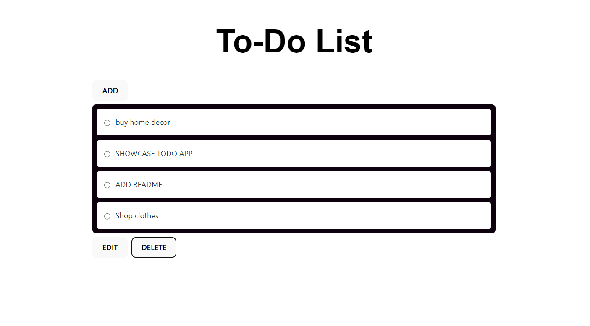

# TO-DO APP

## DEMO

- CRUD-enabled TSX app with Spring Boot backend 
- Polished
- All endpoints are error handled such that they return the correct status codes and messages.
- Implement a logging strategy for requests being processed 
- Used spring swagger for documentation

## Design Goals 

- Simple front-end using modals to add/edit Items
- Back-end configured in Spring with model mapper validation

## Features

- Create and update items using modals
- Fetches items from DB and displays them on window load
- Delete item functionality
- Toast notifications when items are added/edited/deleted or fails to do so
- Create and Edit modals use React Hook Form and specifically the Controller component (from RHF) to update the state as the Items are typed out
- Swagger Documentation
- Logging Strategy on back-end 
- Service and Controller layer on back-end to handle and validate data
- Entity and DTOs establishing title, completion status and when the item was added/last updated

## Future Goals
Need to add in Toast Notifications for strikethrough
Back-end error handling needs to be improved
Sorting by Date

## CHANGE LOGS
## 11/06/2024
- Added testing to my logic and react components - testing

TO-DO:
- struggling to get time-out to design attractively.
